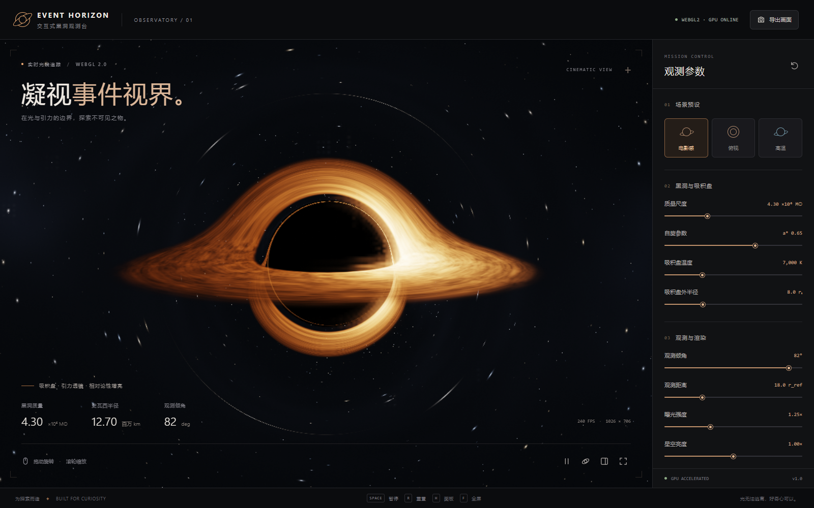
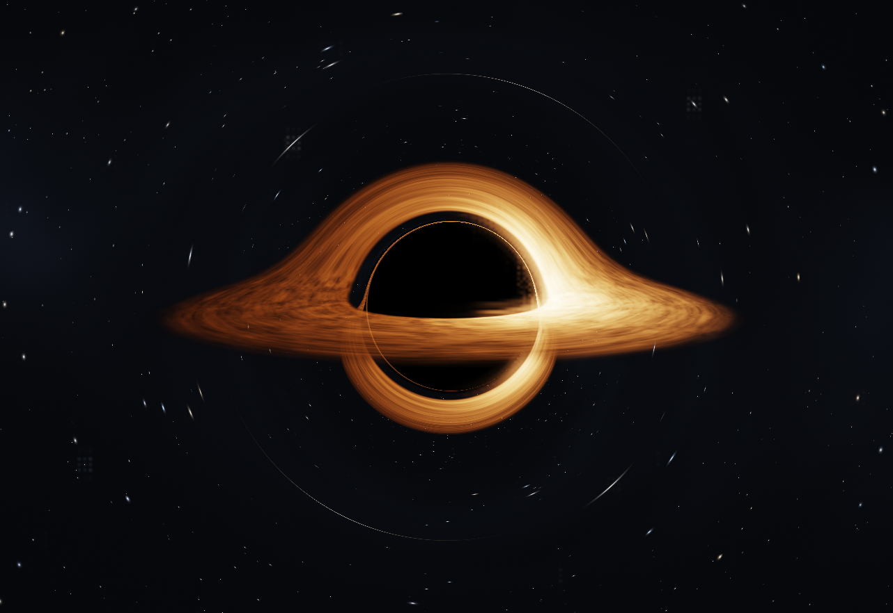

# Event Horizon · GPU Black Hole Observatory

### 在光与引力的边界，探索不可见之物。

一个可以在浏览器中实时探索的黑洞观测台。GPU 逐像素计算弯曲光线路径，绘制黑洞阴影、吸积盘和背景星空；通过参数面板和轨道相机，直观观察不同视角、温度和渲染设置下的变化。

**WebGL 2 · 可调参数 · 实时渲染 · 零运行依赖 · MIT**



> A browser-based, GPU-rendered black hole observatory with interactive controls, curved-ray integration, a procedural accretion disk, camera navigation, and PNG/configuration export. This is an approximate visual model for exploration, not a research-grade general relativity solver.

## 快速开始

需要 **Node.js 20 或更高版本**，以及支持 WebGL 2 的现代 Chrome、Edge 或 Firefox。浏览器应允许图形加速。

```bash
git clone https://github.com/realhc/event-horizon.git
cd event-horizon
npm start
```

打开 [http://127.0.0.1:5173](http://127.0.0.1:5173)。服务默认只监听本机；端口占用时可执行 `npm start -- --port 5174`，也支持 `PORT` 环境变量。Windows 用户也可以运行 `start.cmd`。程序运行不依赖第三方 npm 包，无需先执行 `npm install`。请通过 HTTP 服务打开页面，而不是直接双击 `index.html`。

```bash
npm run dev    # 启动开发用静态服务
npm run build  # 生成 dist/ 静态站点
npm run preview # 本地预览 dist/ 构建结果
npm test       # 运行自动化测试
npm run check  # 检查 JavaScript 语法、测试和构建
```

构建结果保留相对资源路径，可以部署到支持静态文件的 Web 服务。渲染完全在浏览器端进行，无需服务器 GPU、CUDA 或后端推理服务。

## 可以探索什么

- **实时黑洞画面**：弯曲光线路径、黑洞阴影、程序化吸积盘、星空和盘面运动。
- **自由观测**：拖动旋转视角，滚轮改变相机距离；可以切换电影感、俯视、高温三种预设。
- **独立效果开关**：引力透镜、多普勒增亮、吸积盘显示。
- **渲染控制**：三档质量、曝光、星空强度、动画速度，以及暂停、全屏、隐藏参数面板。
- **保存结果**：导出当前画面为 PNG；导出和导入 JSON 参数配置。
- **运行信息**：显示实际渲染分辨率、帧率与可获取的渲染设备信息。



截图来自程序实际运行画面。PNG 导出保存黑洞画布，页面截图则包含界面和参数面板。

## 参数说明

默认电影感预设：质量尺度 `1`、自旋 `0.65`、倾角 `82°`、方位 `0.22 rad`、距离 `18 r_ref`、温度 `7,000 K`、吸积盘外半径 `8 rₛ`、曝光 `1.25`、星空强度 `1`、动画速度 `0.7`，使用均衡质量。

| 参数 | 范围 | 作用 |
| --- | --- | --- |
| 质量尺度 `massScale` | 0.65–1.80 | 改变黑洞与场景的相对尺度，并更新质量、史瓦西半径读数 |
| 自旋 `spin` | 0–0.98 | 改变盘面内缘、运动，并加入微弱的艺术化光线拖拽项 |
| 倾角 `inclination` | 5–89° | 从接近俯视到接近侧视观察吸积盘 |
| 方位 `yaw` | −π–π | 水平拖动控制的相机方位角，单位为弧度 |
| 观测距离 `distance` | 10–40 | 相机距离，以默认质量对应的参考史瓦西半径为单位；滚轮可调 |
| 温度 `temperature` | 3,000–18,000 K | 改变盘面的近似热辐射配色 |
| 吸积盘外半径 `diskOuter` | 5–16 | 发光盘外边界，以当前质量对应的史瓦西半径为单位 |
| 曝光 `exposure` | 0.4–3.0 | 调整最终画面亮度 |
| 星空强度 `stars` | 0–2 | 调整背景星空亮度 |
| 动画速度 `speed` | 0–2 | 改变吸积盘纹理动画的速度 |

光线积分坐标以当前史瓦西半径 `rₛ` 归一化；相机在该坐标中的距离是 `distance / massScale`，因此增加质量尺度会让黑洞在固定参考视距下看起来更大。温度配色、吸积盘尺寸与时间速度不构成真实天体的定量标定。

| 操作 | 快捷方式 |
| --- | --- |
| 改变方位和倾角 | 在画面上拖动 |
| 改变观测距离 | 滚轮 |
| 暂停 / 继续动画 | `Space` |
| 恢复默认参数 | `R` |
| 显示 / 隐藏参数面板 | `H` |
| 进入 / 退出画面全屏 | `F` |

也可以使用界面按钮完成这些操作。启用系统「减少动态效果」偏好时，程序初始暂停动画；参数调整仍会刷新画面，可以手动继续。参数配置采用版本化 JSON；导入时会检查类型和范围，不接受任意脚本。

## GPU 与性能

渲染器使用 WebGL 2 的全屏片元着色器。每个像素独立推进光线，检测是否被黑洞捕获、穿过吸积盘或逃逸到背景，再通过 GPU 泛光与色调映射合成画面；JavaScript 负责相机、参数、时间和界面。画面无需预先生成的黑洞视频或贴图。

浏览器和驱动决定 WebGL 使用的设备。支持时，界面读取 `WEBGL_debug_renderer_info` 显示渲染器名称；如果浏览器出于隐私原因隐藏该信息，设备名称可能不可用，不能据此断言使用了独立显卡。软件渲染器也可能提供 WebGL 2，此时性能会明显降低。

遇到低帧率时：

1. 将渲染质量切换为「流畅」，或缩小浏览器窗口。
2. 在浏览器设置中启用可用的图形 / 硬件加速，重新启动浏览器。
3. 检查显卡驱动与浏览器的 WebGL 状态；Chrome 可打开 `chrome://gpu`，Edge 可打开 `edge://gpu`。

帧率取决于 GPU、窗口尺寸、设备像素比、浏览器与所选质量；项目不承诺固定 FPS。右下角显示的是浏览器动画帧率估计，不是 GPU 时间查询。

## 模型与边界

这是用于探索和视觉演示的**近似模型**。它以受 Schwarzschild 光线路径启发的中心加速度数值推进光线，累计多次盘面交叉的辐射来表现引力透镜和盘面多重影像。吸积盘使用程序纹理、近似热辐射配色与亮度模型；自旋改变盘面表现并加入微弱的艺术化拖拽项，没有实现完整 Kerr 度规、精确测地线或科学级辐射转移。光子环微光、泛光与色调处理也包含视觉增强。

质量读数采用 `M = 4.3 × 10⁶ × massScale M☉`，并以 `rₛ = 2GM/c²` 计算史瓦西半径。默认约为 **4.3 百万太阳质量**与 **1,270 万千米**。这个读数用于给相对尺度提供直观参考；它不意味着相机、盘面尺寸、温度或时间已与某个真实黑洞建立一致的物理标定。自旋变化也不会将这条史瓦西半径公式转换成旋转黑洞的真实事件视界半径。

进一步了解：

- [NASA：Black Hole Accretion Disk Visualization](https://svs.gsfc.nasa.gov/13326/) — 黑洞引力如何改变吸积盘的可见形状与亮度。
- [Khronos：WebGL 2.0 Specification](https://registry.khronos.org/webgl/specs/latest/2.0/) — 浏览器图形 API 的规范。

这些是概念和技术参考；项目源码与截图由本项目生成。

## 项目结构

```text
event-horizon/
├── index.html                 # 观测台界面
├── src/
│   ├── main.js                # 参数面板、相机交互、导入导出、快捷键
│   ├── params.js              # 默认参数、范围、预设与配置校验
│   ├── renderer.js            # WebGL 初始化、尺寸管理与渲染生命周期
│   ├── shaders.js             # GLSL 光线积分、吸积盘和星空
│   └── style.css              # 界面与响应式布局
├── public/favicon.svg
├── docs/screenshots/          # 程序实际截图
├── tests/                     # 自动化测试
├── scripts/
│   ├── server.mjs             # 无依赖 Node 静态服务
│   ├── build.mjs              # 静态构建
│   └── capture.mjs            # 使用真实浏览器重新生成截图
├── package.json
└── LICENSE
```

前端采用原生 ES modules、HTML 和 CSS；GLSL 着色器集中在 `src/shaders.js`，可直接研究或修改光线路径和盘面效果。

## 开发与验证

`npm test` 使用 Node 内置测试运行器检查 HTTP 服务、路径边界、静态构建、参数配置校验与物理读数。`npm run check` 进一步检查 JavaScript 语法并执行测试和构建；这些命令均无需安装开发依赖。

浏览器渲染测试和截图工具是可选的，需要先安装锁定的开发依赖，并在电脑上安装 Chrome：

```bash
npm ci
npm run test:gpu
npm run capture
```

`test:gpu` 使用真实浏览器检查着色器与交互；`capture` 重新生成 `docs/screenshots/` 中的实际运行截图。两者使用已安装的浏览器，不要求另行下载 Playwright Chromium。使用 Edge 时，在 PowerShell 中先执行 `$env:PLAYWRIGHT_CHANNEL = 'msedge'`，再运行对应命令。浏览器测试通过只能确认当前设备上的功能；是否使用硬件 GPU 仍以实际渲染器信息为准。

## License

[MIT](LICENSE) · Copyright © 2026 Hong Chang
